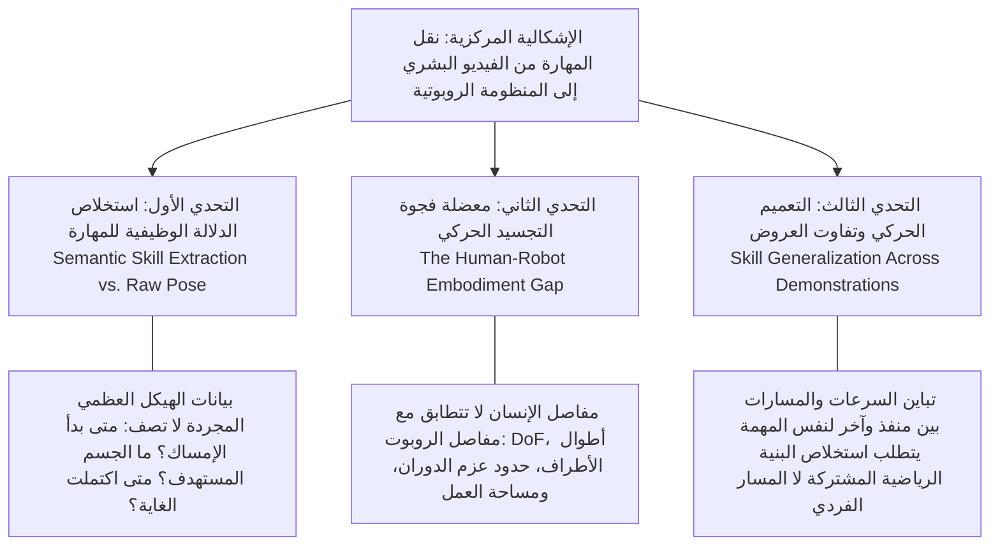
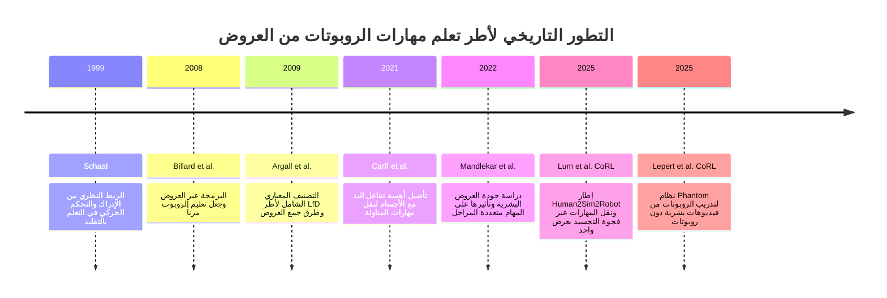
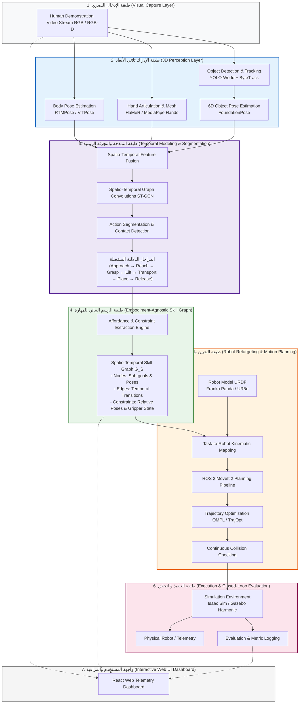
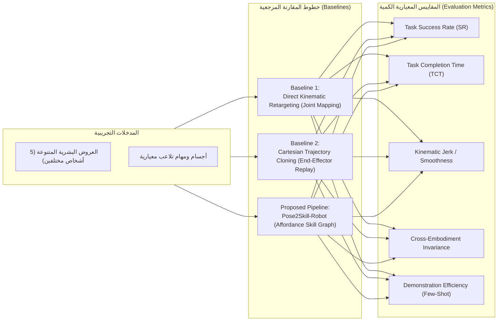
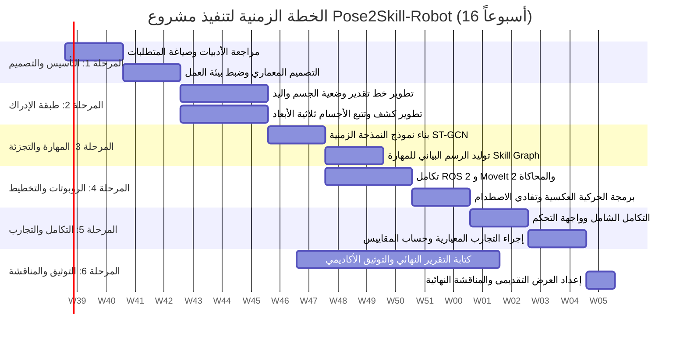

# وثيقة مقترح مشروع التخرج الأكاديمي
## Graduation Project Proposal Document

---

### عنوان المشروع المقترح (Project Title)
* **باللغة العربية:**  
  **Pose2Skill-Robot: نظام ذكي لتعلّم ونقل المهارات البشرية إلى الروبوت باستخدام تقدير الوضعية والتفاعل مع الأجسام**
* **باللغة الإنجليزية (English Title):**  
  **Pose2Skill-Robot: An Intelligent System for Learning and Transferring Human Skills to Robots Using Pose Estimation and Object Interaction**

---

### بطاقة تعريف المشروع (Project Identification)
* **المسار التخصصي:** هندسة البرمجيات والذكاء الاصطناعي / الرؤية الحاسوبية والروبوتات الذكية (Computer Vision & Robotics).
* **المجالات المعرفية المتقاطعة:**
  * الرؤية الحاسوبية ثلاثية الأبعاد (3D Computer Vision & Pose Estimation).
  * تفاعل الإنسان مع الأجسام (Human-Object Interaction - HOI).
  * التعلم من العروض والتقليد الروبوتي (Learning from Demonstration - LfD & Imitation Learning).
  * التخطيط الحركي الروبوتي والحركية العكسية (Motion Planning & Inverse Kinematics).
  * النمذجة البيانية والزمنية للمهارات (Spatio-Temporal Skill Representation).
* **المشرف الأكاديمي:** [اسم المشرف الأكاديمي]
* **فريق العمل:**
  * يعقوب خالد محمد علي المهاجري
  * [اسم العضو الثاني]
  * [اسم العضو الثالث]
  * [اسم العضو الرابع]
* **العام الجامعي:** 2025 / 2026

---

## الملخص التنفيذي (Executive Abstract)

### الملخص باللغة العربية
يُعد نقل المهارات البشرية المعقدة إلى المنظومات الروبوتية أحد أبرز التحديات في مجال أتمتة المهام المرنة وتعلم الروبوتات (Robot Learning). تعتمد المقاربات التقليدية في "التعلم من العروض" (Learning from Demonstration - LfD) على النسخ المباشر لمسارات الحركة (Trajectory Mimicry) أو مطابقة إحداثيات المفاصل (Joint-to-Joint Mapping)، وهو ما يصطدم بصورة حتمية بمعضلة "فجوة التجسيد" (Human-Robot Embodiment Gap) واختلاف درجات الحرية (Degrees of Freedom) والقيود الحركية والميكانيكية بين الإنسان والروبوت.  
يهدف هذا المشروع إلى تصميم وتطوير نظام ذكي متكامل يُدعى **Pose2Skill-Robot**، يقوم باستخلاص المهارات الحركية والتلاعبية الكامنة من عروض الفيديو البشرية المجردة (RGB/RGB-D Video Demonstrations)، ليس عبر تقليد الحركة الفيزيائية السطحية، بل عبر استنباط "الدلالة الوظيفية للمهارة" ونظرية الإتاحة (Affordance Theory) والتفاعل الزمني-المكاني بين اليد والجسم (Human-Object Interaction - HOI).  
يقوم النظام عبر خط معالجة متعدد الطبقات بتقدير وضعية الهيكل العظمي ثلاثي الأبعاد لجسم الإنسان واليد، وتتبع حركة الأجسام في البيئة، وتجزئة الحركة زمنياً إلى أفعال أولية (Action Primitives) مثل (Approach, Reach, Grasp, Lift, Move, Place, Release)، وبناء "رسم بياني وسيط للمهارة" (Spatio-Temporal Affordance Skill Graph) مستقل عن الهيكل العضلي للإنسان. يتم لاحقاً تعيين هذا الرسم البياني إلى نظام تخطيط المسارات الروبوتية خالية التصادم (Collision-Free Motion Planning) باستخدام إطار ROS 2 و MoveIt 2، وتنفيذه واختباره داخل بيئات المحاكاة المتقدمة (Isaac Sim / Gazebo) على أذرع روبوتية مختلفة (Franka Emika Panda و UR5e). يُبرهن المشروع على قابلية تعميم المهارة المستخلصة ونقلها عبر هياكل روبوتية غير متطابقة بكفاءة وموثوقية عالية.

**الكلمات المفتاحية:** التعلم من العروض (LfD)، تقدير الوضعية ثلاثي الأبعاد (3D Pose Estimation)، تفاعل اليد مع الأجسام (Hand-Object Interaction)، فجوة التجسيد (Embodiment Gap)، الرسوم البيانية للمهارات (Skill Graphs)، التخطيط الحركي (Motion Planning)، ROS 2، MoveIt 2.

---

### Abstract (English)
Transferring versatile human manipulation skills to robotic manipulators remains a cornerstone challenge in modern robotics. Traditional Learning from Demonstration (LfD) and Imitation Learning (IL) paradigms frequently suffer from direct trajectory replay or joint-to-joint correspondence, failing inevitably due to the fundamental **Human-Robot Embodiment Gap**—characterized by kinematic disparities, differing degrees of freedom (DoF), and morphological discrepancies.  
This project proposes **Pose2Skill-Robot**, a novel, end-to-end intelligent system that extracts transferable, object-centric manipulation skills from monocular/RGB-D human demonstration videos. Rather than executing shallow kinematic mimicry, Pose2Skill-Robot abstracts the underlying functional intent by coupling 3D human body/hand pose estimation with 6D object pose tracking and spatio-temporal affordance reasoning.  
The core architecture consists of: (1) a multi-modal 3D perception pipeline (body/hand pose and object trajectory extraction); (2) a temporal action segmentation layer utilizing spatio-temporal modeling to identify atomic manipulation primitives (e.g., approach, reach, grasp, lift, transport, place, release); (3) an embodiment-agnostic **Spatio-Temporal Affordance Skill Graph**; and (4) a robotic retargeting and motion planning engine driven by ROS 2 and MoveIt 2 for collision-free trajectory execution. The framework is benchmarked across high-fidelity simulation environments (Isaac Sim / Gazebo) on multi-DoF manipulators (Franka Emika Panda 7-DoF and UR5e 6-DoF). Empirical evaluations demonstrate superior task generalization, resilience against morphological differences, and enhanced sample efficiency compared to conventional kinematic mapping baselines.

**Keywords:** Learning from Demonstration (LfD), 3D Pose Estimation, Hand-Object Interaction (HOI), Embodiment Gap, Skill Graph Representation, Motion Planning, ROS 2, MoveIt 2, Isaac Sim.

---

## 1. المقدمة والسياق العام للمشروع (Introduction & Scientific Context)

شهدت العقود الأخيرة تطوراً نوعياً في قدرة الأذرع الروبوتية على تنفيذ المهام الميكانيكية المتكررة في خطوط الإنتاج التقليدية، غير أن هذه القدرات ما تزال حبيسة البيئات المهيكلة بدقة صارمة والبرمجة اليدوية المضنية لكل حركة على حدة. مع ظهور الثورة الصناعية الرابعة (Industry 4.0) والحاجة المتزايدة للروبوتات الخدمية والمعاونة (Collaborative & Assistive Robotics)، أضحى تعليم الروبوت مهمة جديدة وسلسلة من المناولات والتفاعلات البيئية متطلباً حاسماً يتجاوز البرمجة الصلبة (Hard-coded Scripting).

يُعد حقل **التعلم من العروض (Learning from Demonstration - LfD)** وحقل **التعلم بالتقليد (Imitation Learning - IL)** من أخصب الاتجاهات البحثية في الذكاء الاصطناعي الروبوتي (Argall et al., 2009; Schaal, 1999). تقوم الفلسفة التأسيسية لهذا الحقل على تمكين الروبوت من اكتساب المهارات السلوكية من خلال ملاحظة عروض يقدمها الخبراء البشريون. ومع ذلك، واجهت الأجيال الأولى من أنظمة LfD قيوداً جوهرية تمثلت في الاعتماد على أجهزة تحكم باللمس (Teleoperation)، أو التوجيه الحركي اليدوي لذراع الروبوت (Kinesthetic Teaching)، وهي أساليب مكلفة وتتطلب وقتاً طويلاً ومعدات خاصة، وتحد من مرونة اكتساب المهارة من مصادر بصرية طبيعية كفيديوهات الإنسان اليومية.

ومع الطفرة الهائلة في تقنيات **الرؤية الحاسوبية (Computer Vision)** والتعلم العميق، برز اتجاه متسارع لتعلم المهارات من الفيديو البشري المجرد (Visual LfD). غير أن الانتقال من مشاهدة الإنسان في الفيديو إلى تنفيذ الروبوت للحركة يفجر تحديات معرفية وفيزيائية معقدة، تقع في صلب ما يُعرف في الأدبيات بـ **"معضلة الملاءمة" (The Correspondence Problem)** و **"فجوة التجسيد بين الإنسان والروبوت" (Human-Robot Embodiment Gap)** (Lum et al., 2025). إن الإنسان يمتلك جهازاً حركياً عضلياً شديد المرونة بأكثر من 27 درجة حرية في اليد والذراع، تختلف هندسياً وديناميكياً عن مفاصل الروبوتات الصناعية (المحصورة غالباً بين 6 إلى 7 درجات حرية).

من هنا ينطلق مشروع **Pose2Skill-Robot** ليقدم إطاراً علمياً وتطبيقياً متقدماً، يتجاوز النظرة السطحية لحركات المفاصل المجردة نحو **استخلاص المعنى الدلالي للمهارة (Semantic Skill Extraction)** وربطها بنظرية التفاعل والإتاحة بين اليد والجسم (Carfì et al., 2021). يتيح هذا النهج بناء طبقة وسيطة تمثل جوهر المهمة بشكل مستقل عن بنية المنفذ (Embodiment-Agnostic)، مما يسمح للروبوت بإعادة صياغة المسار وتخطيطه ذاتياً بما يتلاءم مع قيوده الحركية والفيزيائية وبيئة عمله.

---

## 2. المشكلة والأبعاد البحثية (Problem Statement & Core Challenges)

### 2.1 الإشكالية الجوهرية (Core Problem Statement)
تتمثل الإشكالية المركزية التي يعالجها هذا المشروع في السؤال العلمي والتقني التالي:  
> **"كيف يمكن لمنظومة ذكية أن ترصد وتحلل عرضاً بشرياً مصوراً عبر الفيديو أثناء تأدية مهمة مناولة وتفاعل مع الأجسام، وتستخلص بنية المهارة الوظيفية المجردة في نموذج وسيط مستقل عن الجسد، ثم تعيد تخطيطها وتنفيذها بنجاح ودقة عبر ذراع روبوتية ذات تركيبة حركية وميكانيكية مغايرة تماماً لبنية الإنسان؟"**

### 2.2 تفكيك الإشكالية إلى تحديات بحثية فرعية (Decomposed Research Challenges)

#### التحدي الأول: استخلاص المهارة من الحركة المرصودة (Skill Extraction vs. Raw Pose Tracking)
لا تعبر متوالية إحداثيات المفاصل البشرية المكتشفة بالرؤية الحاسوبية بذاتها عن المهارة؛ فإذا كان الفيديو يعرض شخصاً يلتقط كأساً وينقله فوق رف مرتفع، فإن مجرد تسجيل إحداثيات النقاط $(x, y, z)$ لا يقدم إجابات حاسمة حول:
* متى بدأت مرحلة الاقتراب والوصول (Approach & Reach)؟
* متى تم التحول إلى حالة الإغلاق والإمساك المستقر (Stable Grasp)؟
* ما الخصائص الهندسية والدلالية للجسم الذي تم التلاعب به؟
* ما نقطة الانتقال التي تحول فيها الفعل من حركة حرة في الفضاء إلى حركة مقيدة بحمل الجسم (Constrained Manipulation)؟
* ما الشرط الحركي أو المكاني الذي يُعلن عنده اكتمال المهمة بنجاح (Goal Condition)؟  
لذا، لا بد من خوارزمية ذكية تُجزئ الحركة زمنياً ومكانياً إلى أفعال أولية دلالية (Atomic Skill Primitives).

#### التحدي الثاني: فجوة التجسيد والملاءمة الحركية (Human-Robot Embodiment Gap)
من الاستحالة بمكان افتراض اقتران مباشر بين مفاصل الإنسان ومفاصل الروبوت:
$$\text{Joint}_{Human}^{(i)} \not\to \text{Joint}_{Robot}^{(i)}$$
يعود ذلك للفوارق الجذرية في:
1. **التركيبة الكينماتيكية:** تمتلك الذراع البشرية مع الكتف والمعصم مرونة فائقة تتجاوز 7 درجات حرية، بينما تمتلك كف اليد وحدها ما يربو على 20 درجة حرية، مقارنة بملاقط الروبوتات ذات الإصبعين (Parallel Grippers) أو الأيدي الروبوتية البسيطة.
2. **حدود الحركة ومساحة العمل (Workspace & Joint Limits):** تختلف مساحة الوصول ونطاقات زوايا الدوران وحدود السرعة والتسارع في محركات الروبوت اختلافاً كلياً عن المرونة العضلية.
3. **القيود الذاتية والاصطدام (Self-collision & Environmental Obstacles):** قد تكون الحركة البشرية آمنة للمنفذ، ولكن تنفيذ المسار ذاته بواسطة ذراع معدنية قد يؤدي لاصطدام روابط الروبوت بنفسه أو بعوائق البيئة المحيطة (Lum et al., 2025).

#### التحدي الثالث: تعميم المهارة عبر التباين البشري والظروف المتغيرة (Skill Generalization)
يؤدي البشر المهمة الواحدة بأساليب ومسارات متباينة للغاية؛ فشخص ما قد يلتقط الكأس بحركة قوسية علوية لتفادي عائق خفي، وآخر قد يرفعه بمسار جانبي مستقيم وبسرعة مضاعفة. إذا قام الروبوت بحفظ المسار النقطي المحدد لشخص واحد، فإنه سيفشل بمجرد إزاحة موقع الكأس بسنتيمترات قليلة أو تغير سرعة التنفيذ. يتطلب الحل الحقيقي استخلاص **الثوابت الطوبولوجية والدلالية للمهمة (Task Invariants)** التي تحكم العلاقة بين اليد، الجسم، والهدف، لضمان التعميم (Mandlekar et al., 2022).

---

### 2.3 الصياغة الرياضية للمسألة (Mathematical Problem Formulation)

دع العرض البشري المرصود يُعرّف كمتوالية زمنية طولها $T$ إطاراً مستخلصة من الفيديو:
$$\mathcal{D}_H = \left\{ \left( \mathbf{p}_t^H, \mathbf{h}_t^H, \mathbf{o}_t \right) \right\}_{t=1}^{T}$$
حيث:
* $\mathbf{p}_t^H \in \mathbb{R}^{J_b \times 3}$: تمثل وضعيات مفاصل الهيكل العظمي للجسم البشري في الفضاء الديكارتي ثلاثي الأبعاد.
* $\mathbf{h}_t^H \in \mathbb{R}^{J_h \times 3}$: تمثل وضعيات مفاصل اليد وأطراف الأصابع وإغلاق القبضة.
* $\mathbf{o}_t = \{(\mathbf{x}_i, \mathbf{R}_i, \mathbf{c}_i)_t\}_{i=1}^{M}$: تمثل متوالية الوضعيات السداسية (6D Poses: Position $\mathbf{x} \in \mathbb{R}^3$, Orientation $\mathbf{R} \in SO(3)$) والتصنيف الدلالي $\mathbf{c}_i$ لعدد $M$ من الأجسام المتفاعلة.

تتولى دالة التجزئة واستخلاص المهارة $\Phi_{\text{skill}}$ تحويل هذه السلسلة المتواصلة من الإحداثيات إلى **رسم بياني زماني-مكاني للمهارة (Spatio-Temporal Skill Graph)**:
$$\mathcal{G}_S = \Phi_{\text{skill}}(\mathcal{D}_H) = \langle \mathcal{V}_S, \mathcal{E}_S, \mathcal{C}_S \rangle$$
حيث تتكون العقد $\mathcal{V}_S$ من متوالية الأفعال الفرعية المنفصلة:
$$\mathcal{V}_S = \{ s_k \}_{k=1}^{K}, \quad s_k \in \{\text{Approach}, \text{Reach}, \text{Grasp}, \text{Lift}, \text{Transport}, \text{Place}, \text{Release}\}$$
وتحدد الحواف $\mathcal{E}_S$ الشروط الزمنية وعلاقات الترتيب والانتقال، بينما تفرض $\mathcal{C}_S$ قيود الإتاحة (Affordance Constraints) ومحددات الوضعية الديكارتية النسبية لأداة النهاية الروبوتية مقارنة بالجسم:
$$\mathcal{C}_S = \left\{ f_{\text{rel}}(\mathbf{x}_{EE}, \mathbf{x}_{\text{target}}) \leq \epsilon, \; \text{State}_{\text{gripper}} \in \{0, 1\} \right\}$$

في المرحلة اللاحقة، تقوم دالة التخطيط والتحويل الحركي $\Psi_{\text{robot}}$ بتعيين الرسم البياني $\mathcal{G}_S$ إلى فضاء التكوين الحركي للروبوت $\mathcal{Q} \subset \mathbb{R}^{N_{DoF}}$ عبر حل مسألة التحسين المقيدة:
$$\mathbf{q}^*(t) = \arg\min_{\mathbf{q}(t)} \int_0^{T'} \left( \|\dot{\mathbf{q}}(t)\|^2 + \lambda \|\ddot{\mathbf{q}}(t)\|^2 \right) dt$$
خاضعة للقيود الصارمة التالية:
$$\begin{cases} 
\mathbf{q}_{\min} \leq \mathbf{q}(t) \leq \mathbf{q}_{\max} & \text{(Joint Limits)} \\
\dot{\mathbf{q}}_{\min} \leq \dot{\mathbf{q}}(t) \leq \dot{\mathbf{q}}_{\max} & \text{(Velocity Limits)} \\
\mathcal{F}_{FK}(\mathbf{q}(t)) = \mathbf{T}_{EE}(t) \in \mathcal{C}_S & \text{(End-Effector Task Constraint)} \\
\text{Distance}(\text{Robot}(\mathbf{q}(t)), \mathcal{O}_{\text{env}}) > d_{\text{safe}} & \text{(Collision Avoidance)}
\end{cases}$$
حيث تمثل $\mathcal{F}_{FK}(\cdot)$ الحركية الأمامية للروبوت (Forward Kinematics)، و $\mathcal{O}_{\text{env}}$ عوائق البيئة.

---

## 3. الأسئلة والفرضيات البحثية (Research Questions & Hypotheses)

### 3.1 الأسئلة البحثية (Research Questions - RQs)
* **السؤال البحثي الأول (RQ1):** كيف يمكن تحويل تيارات الفيديو المستمرة للبشر والأجسام إلى تمثيل بنيوي مجرد (Abstract Structured Representation) يحدد بدقة نقاط التحول الحرجة للأفعال دون الحاجة إلى توصيف يدوي للخطوات؟
* **السؤال البحثي الثاني (RQ2):** إلى أي مدى ينجح تمثيل المهارة المتمحور حول التفاعل مع الأجسام (Object-Centric & Affordance-Based) في تجسير فجوة التجسيد بين الإنسان والروبوت مقارنة بالمحاكاة الحركية المباشرة (Direct Kinematic Retargeting)؟
* **السؤال البحثي الثالث (RQ3):** هل يتيح هذا التمثيل الوسيط للمهارة تنفيذها بكفاءة متساوية على منصات روبوتية ذات درجات حرية وهياكل حركية مختلفة (Cross-Embodiment Transfer) دون إعادة تعلم المهارة من الصفر؟

### 3.2 الفرضيات البحثية (Research Hypotheses)
* **الفرضية البحثية الأولى ($H_1$):**  
  *"إن صياغة العروض البشرية في صورة تمثيل دلالي للمهارة (Task-Level Skill Representation) قائم على تقدير الوضعية والتفاعل الزمني مع الأجسام يحقق معدل نجاح للمهمة (Task Success Rate) أعلى بمقدار ذي دلالة إحصائية ($p < 0.01$) مقارنة بخطوط الأساس المعتمدة على محاكاة المسارات الديكارتية أو زوايا المفاصل المباشرة."*
* **الفرضية البحثية الثانية ($H_2$):**  
  *"يمتلك الرسم البياني للمهارة المستخلص مناعة ومرونة طوبولوجية (Embodiment Invariance) تمكنه من الانتقال بين أذرع روبوتية مختلفة التركيب (مثال: من ذراع 7-DoF إلى ذراع 6-DoF) مع الحفاظ على معدل نجاح يتجاوز 85% من أداء المهمة الأساسية داخل بيئة المحاكاة."*

---

## 4. أهداف المشروع (Project Objectives)

### 4.1 الهدف العام (General Strategic Goal)
تطوير منظومة روبوتية معرفية ذكية متكاملة البرمجيات قادرة على استيعاب المهارات البشرية التلاعبية الدقيقة من تسجيلات الفيديو البصرية المجردة، وبناء نموذج مهارة وسيط مستقل عن الجسد، وتحويله آلياً إلى مسارات حركية روبوتية خالية من التصادم قابلة للتنفيذ الموثوق عبر أذرع روبوتية متعددة داخل بيئات المحاكاة والواقع.

### 4.2 الأهداف التفصيلية والتشغيلية (Specific Operational Objectives - SMART)
1. **تطوير طبقة إدراك بصري هجينة فائقة الدقة (Hybrid Perception Pipeline):**
   * دمج أحدث نماذج تقدير وضعية الجسم ثلاثية الأبعاد (3D Human Pose) واليدين (Hand Articulation) مثل RTMPose/ViTPose/HaMeR.
   * دمج نماذج كشف وتتبع الأجسام ثلاثية الأبعاد (6D Object Pose Tracking) بدقة زمنية لا تقل عن 25 إطاراً في الثانية (FPS).
2. **تصميم وتدريب محرك النمذجة والتجزئة الزمنية (Temporal Action Segmentation Engine):**
   * توظيف شبكات الالتفاف البيانية الزمانية-المكانية (ST-GCN) ومحولات الانتباه الزمني (Temporal Action Transformers) لتقسيم الحركة المستمرة إلى متوالية أفعال دلالية منتهية بدقة تصنيف وتوقيت تتجاوز 90%.
3. **توليد نموذج تمثيل المهارة المستقل عن التجسيد (Embodiment-Agnostic Skill Graph):**
   * صياغة محرك خوارزمي لبناء الرسم البياني للمهارة وتحديد نقاط الإمساك والإتاحة (Affordance & Contact Points) وقيود الانتقال، بما يعزل ديناميكية الذراع البشرية تماماً عن منطق المهمة.
4. **تطوير آلية التعيين الحركي والتخطيط الآمن (Kinematic Mapping & Motion Synthesis):**
   * ربط المهارات بنظام ROS 2 وحزمة التخطيط الحركي MoveIt 2 لتوليد مسارات أداة النهاية الروبوتية (End-Effector Trajectories) مع حل الحركية العكسية (IK) وتجنب العوائق وحدود المفاصل تلقائياً.
5. **الاختبار والتجريب المرجعي الشامل (Cross-Platform Benchmarking):**
   * التحقق التجريبي من المنظومة عبر 4 مهام تلاعب قياسية في بيئة المحاكاة (Isaac Sim / Gazebo) واختبار قدرة النقل المتقاطع بين ذراع Franka Emika Panda (7 DoF) وذراع Universal Robots UR5e (6 DoF).
6. **بناء واجهة تفاعلية للرصد والتحكم (Interactive Telemetry Dashboard):**
   * تطوير واجهة ويب حديثة توفر رؤية متزامنة للفيديو الأصلي، الهياكل المكتشفة، الرسم البياني للمهارة، والمسار الروبوتي في المحاكي مع مؤشرات الأداء الحية.

---

## 5. الأهمية العلمية والقيمة التطبيقية (Significance & Value Proposition)

### 5.1 الأهمية العلمية والأكاديمية (Scientific & Academic Novelty)
* **المساهمة في سد فجوة التجسيد:** تقديم حل منهجي لمعضلة تاريخية في الروبوتات من خلال الفصل المعماري بين "إدراك دلالة المهارة" و"توليد حركية المنفذ".
* **إثراء دراسات تفاعل الإنسان مع الأجسام (HOI):** الانتقال من الاكتفاء بتصنيف التفاعل البشري في الفيديو إلى إعادة تجسيده وظيفياً وميكانيكياً بواسطة الروبوت (Carfì et al., 2021).
* **تقليل الاعتماد على العروض الروبوتية المباشرة:** معالجة مشكلة شح البيانات الروبوتية (Data Scarcity) عبر الاستفادة من الثروة الهائلة من الفيديوهات البشرية المتوفرة دون الحاجة لجمع بيانات شاقة عبر أجهزة التحكم عن بعد (Lepert et al., 2025).

### 5.2 الأهمية الصناعية والتطبيقية (Industrial & Practical Applications)
* **المصانع وخطوط التجميع الذكية (Industry 4.0):** تمكين عمال المصانع من تعليم الروبوتات الصناعية مهام التجميع الدقيق والفرز والتعبئة من خلال تأديتها أمام كاميرا عادية لمرة واحدة أو مرات معدودة، دون كتابة سطر برمجي واحد.
* **المستودعات والخدمات اللوجستية المؤتمتة:** تكيف الروبوت السريع مع التقاط ورص طرود ومنتجات ذات أشكال ومواقع جديدة بمجرد عرض أسلوب مسكها بواسطة عامل بشري.
* **الروبوتات المساعدة والرعاية الصحية (Assistive & Healthcare Robotics):** إمكانية تعليم الروبوتات المنزلية أو المعاونة لكبار السن مهاماً يومية مخصصة (تقديم الدواء، ترتيب الأواني، المناولة الآمنة) وفق تفضيلات وظروف كل مستخدم.

### 5.3 الميزة التنافسية والتحول النوعي في النموذج (Paradigm Shift)

| وجه المقارنة | النهج التقليدي الشائع (Direct Trajectory Retargeting) | نهج مشروعنا المقترح (Pose2Skill-Robot Pipeline) |
| :--- | :--- | :--- |
| **الفلسفة الأساسية** | تقليد مسار المفاصل أو النقطة الديكارتية أعمى (Blind Mimicry). | فهم دلالة المهمة واستخلاص شروط الإتاحة والهدف (Intent & Affordance). |
| **الاعتماد على الهيكل** | شديد الارتباط بهيكل الإنسان؛ يفشل عند اختلاف عدد المفاصل. | مستقل تماماً عن التجسيد البشري (Embodiment-Agnostic). |
| **التكيف مع العوائق** | يعيد إنتاج نفس المسار حتى لو اصطدم بعائق جديد في بيئة الروبوت. | يعيد تخطيط مسار خالٍ من التصادم في بيئة الروبوت مع حفظ جوهر المهارة. |
| **التعميم ونقل المهارة** | مقيد بذراع روبوتية واحدة تم ضبط أبعادها خصيصاً للمسار. | قابل للنقل المباشر إلى منصات روبوتية متعددة (Franka, UR5e, KUKA). |
| **حجم البيانات المطلوب** | يتطلب معايرة معقدة وعشرات التكرارات للتغلب على الأخطاء. | يعتمد مبدأ كفاءة العينات (Few-Shot Demonstration Efficiency). |

---

## 6. الدراسات السابقة والإطار النظري (Literature Review & Related Work)

يستند المشروع إلى تراث علمي رصين في تقاطع مجالات الرؤية والتعلم والتحكم الروبوتي، ويمكن تصنيف الدراسات المرجعية المؤطرة للمشروع وفق المحاور التالية:

### 6.1 الدراسات التأسيسية لأطر التعلم من العروض (Foundational LfD Frameworks)
وضع **Schaal (1999)** الأسس المعرفية لاستخدام التعلم بالتقليد في بناء الروبوتات الذكية، مبيناً أن التقليد ليس مجرد تسجيل مسارات، بل يمثل حلقة وصل بين الإدراك البصري وتوليد القوى والحركات الديناميكية التكيفية. وتوسع **Billard et al. (2008)** في تفصيل "برمجة الروبوت بالعروض" (Robot Programming by Demonstration - PbD)، مؤكدين ضرورة استخلاص السمات الإحصائية للحركة لحل مسألة تعميم المهام. وقدم **Argall et al. (2009)** المراجعة المرجعية الأشهر التي صنفوا فيها أساليب LfD وفق نوعين رئيسيين: توليد السياسات منخفضة المستوى (Low-level Policies) والتخطيط على مستوى المهمة (High-level Task Learning)، محددين معضلة الملاءمة (The Correspondence Problem) كعائق هيكلي رئيسي أمام استخدام الفيديوهات البشرية.

### 6.2 تفاعل اليد مع الأجسام ونقل المهارات التلاعبية (Hand-Object Interaction in Manipulation)
أحدثت أبحاث التفاعل بين اليد والجسم ثورة في فهم مناولة الروبوتات؛ حيث قدم **Carfì et al. (2021)** مراجعة شاملة أثبتت أن محاولة استخلاص مهارات الروبوت من مراقبة وضعية اليد البشرية بمعزل عن هندسة وخصائص الجسم المستهدف تؤدي إلى أداء متدنٍ، مؤكدين أن جوهر المهارة يكمن في العلاقات المتبادلة (Spatial Relations) ونقاط الاتصال وقوى الإمساك المتولدة أثناء الحدث. وفي سياق متصل، برهن **Iodice et al. (2022)** على إمكانية استخراج مهارات المناولة الديناميكية التعاونية من تسجيلات الفيديو باستخدام تقدير الهيكل العظمي ثلاثي الأبعاد، ثم استخلاص المتغيرات الديناميكية وإعادة نمذجتها داخل بيئة محاكاة روبوتية.

### 6.3 التطورات الراهنة: كسر فجوة التجسيد والتعلم دون بيانات روبوتية (State-of-the-Art 2022–2025)
درس **Mandlekar et al. (2022)** في المؤتمر الخامس لتعلم الروبوتات (CoRL 2022) تأثير جودة العروض البشرية المجمعة دون اتصال (Offline Demonstrations) على أداء الروبوت في مهام التلاعب متعددة المراحل، وأكدوا أن التحدي الأكبر يكمن في قدرة الخوارزمية على معالجة التباين في سرعة وأسلوب تنفيذ البشر للمهمة.  
وفي أحدث الأوراق المنشورة في **مؤتمر تعلم الروبوتات (CoRL 2025)**:
* قدم **Lum et al. (2025)** إطار عمل رائد بعنوان **Human2Sim2Robot**، حيث نجحوا في عبور فجوة التجسيد بين الإنسان والروبوت بالاعتماد على عرض بشري واحد بصيغة RGB-D. ركز الإطار على استخلاص مسار الجسم وتتبع وضعية اليد لتدريب سياسة تعلم تعزيزي في المحاكاة ثم نقلها إلى الروبوت الفيزيائي، مما أثبت إمكانية الاستغناء عن مطابقة المفاصل المباشرة.
* وفي المؤتمر ذاته، قدم **Lepert et al. (2025)** نظام **Phantom** الذي أثبت إمكانية تدريب الروبوتات بالكامل من فيديوهات بشرية دون الحاجة إلى جمع أي عروض توجيهية عبر الروبوت نفسه، وذلك بالاعتماد على تقدير دقيق لوضعيات الأيدي ومعالجة الاختلافات البصرية والتجسيدية بين بيئة الإنسان والروبوت.

### 6.4 مصفوفة المقارنة المرجعية وتحديد الفجوة البحثية (Research Gap Matrix)

| المرجع الأكاديمي | المصدر والنوع | المدخلات الأساسية | طريقة تمثيل المهارة | معالجة فجوة التجسيد | منصة التنفيذ | الفجوة المتبقية وموقع مشروعنا المقترح |
| :--- | :--- | :--- | :--- | :--- | :--- | :--- |
| **Argall et al. (2009)** | Robotics & Auton. Sys. | عروض حركية / أجهزة | سياسات تحكم مباشرة | غير معالجة بصرياً | منصات متنوعة | رصد نظري دون حل برمجي للفيديوهات أحادية العين. |
| **Carfì et al. (2021)** | Frontiers in Rob. & AI | أجهزة استشعار / RGB-D | تصنيف تفاعل اليد | معالجة مفاهيمية | ذراع تجريبية | ركزت على تصنيف الإمساك دون التخطيط للمسار الكامل. |
| **Iodice et al. (2022)** | Mechatronics (Elsevier) | RGB Video (OpenPose) | مسارات ديناميكية 3D | عبر مواءمة الأبعاد | ذراع كينماتيكية | ارتباط المسار بهيكل الشخص المستهدف ونقص التعميم. |
| **Mandlekar et al. (2022)** | CoRL 2022 (PMLR) | عروض LfD مسجلة | خوارزميات تقليد IL | ضمن إطار الروبوت نفسه | محاكاة Robomimic | اقتصرت على بيانات تم جمعها بذراع الروبوت مسبقاً. |
| **Lum et al. (2025)** | CoRL 2025 (PMLR) | 1 RGB-D Video | Reinforcement Learning | حل بالتعلم التعزيزي | محاكاة ثم حقيقي | استهلاك حوسبي هائل في تدريب الـ RL لكل مهارة. |
| **Lepert et al. (2025)** | CoRL 2025 (PMLR) | فيديوهات بشرية ضخمة | مواءمة المجال البصري | مواءمة تمثيل الأيدي | روبوت ثنائي الأذرع | تعقيد بصري كبير وحاجة لحوسبة سحابية مكثفة. |
| **Pose2Skill-Robot (المقترح)** | **مشروع التخرج الحالي** | **فيديو بشري (RGB/RGB-D)** | **رسم بياني زماني-مكاني للمهارة (Affordance Graph)** | **فصل كلي عبر تمثيل مستقل وتخطيط MoveIt 2** | **Isaac Sim / Gazebo + Franka / UR5e** | **يقدم حلاً حوسبياً كفؤاً يجمع الإدراك البياني والتخطيط الآمن دون الحاجة لتدريب RL مكلف.** |

---

## 7. البنية المعمارية ومنهجية النظام (System Architecture & Methodology)

تعتمد معمارية **Pose2Skill-Robot** على نموذج معياري متعدد الطبقات (Modular Multi-Tier Architecture) يضمن الفصل التام بين طبقة الإدراك، وطبقة التمثيل الدلالي للمهارة، وطبقة التخطيط والتحكم الروبوتي.

### 7.1 طبقة الإدراك ثلاثي الأبعاد (3D Perception Layer)
تتولى هذه الطبقة تحويل الإطارات البصرية إلى تدفقات إحداثية زمانية-مكانية متزامنة:
* **تقدير وضعية الجسم (Body Pose Estimation):** استخدام نموذج **RTMPose** أو **ViTPose** لسرعته الفائقة ودقته العالية في استخراج إحداثيات مفاصل الجذع والذراعين والكتفين في الفضاء الديكارتي ثلاثي الأبعاد.
* **تقدير وضعية وتفاصيل اليدين (Hand Articulation & Mesh):** استخدام **HaMeR** (Hand Mesh Recovery) أو **MediaPipe Hands** لاستخراج هندسة كف اليد، انحناءات الأصابع، وحالة فتح وإغلاق القبضة بدقة متناهية لتحديد أوقات الإمساك والإفلات.
* **كشف وتتبع الأجسام ثلاثية الأبعاد (6D Object Pose & Tracking):** توظيف **YOLO-World** لكشف الأجسام المفتوحة المفردات (Open-vocabulary Object Detection)، مقترناً بخوارزمية **ByteTrack** لضمان استمرارية معرفات الأجسام، واستخدام **FoundationPose** لتقدير الوضعية الفضائية السداسية (الموقع الديكارتي وزوايا التوجيه) للأجسام المستهدفة بالتلاعب.

### 7.2 طبقة النمذجة والتجزئة الزمنية (Temporal Modeling & Action Segmentation)
بدلاً من معاملة الحركة ككتلة مصمتة، يتم تغذية الإحداثيات المستمرة للهيكل العظمي والأجسام إلى شبكة التفافية زمانية-مكانية:
* **شبكة ST-GCN ومحولات الانتباه الزمني:** تقوم بتمثيل مفاصل الإنسان والأجسام كعقد في رسم بياني ديناميكي، حيث ترتبط العقد بصلات فيزيائية (عظام الأطراف) وصلات زمانية (بين الإطار $t$ والإطار $t+1$).
* **كشف نقاط الاتصال والتحول (Contact & Boundary Detection):** تقوم الوحدة برصد التغيرات اللحظية في السرعات، التسارعات، والمسافة الفاصلة بين أطراف الأصابع وأسطح الأجسام، لتجزئة العرض إلى أفعال أولية محددة:
  $$\text{Timeline} = [\text{Approach}] \to [\text{Reach}] \to [\text{Grasp}] \to [\text{Lift}] \to [\text{Transport}] \to [\text{Place}] \to [\text{Release}]$$

### 7.3 طبقة تمثيل المهارة المستقلة عن التجسيد (Embodiment-Agnostic Skill Graph)
تُبنى هنا النواة الابتكارية للمشروع عبر تشييد الرسم البياني للمهارة $\mathcal{G}_S$:
* **العقد (Nodes):** تمثل الأهداف المرحلية (Sub-goals) متضمنة الموقع الديكارتي النسبي المطلوب بين أداة النهاية الروبوتية والجسم، وزوايا الاقتراب المثلى (Approach Vectors).
* **الحواف (Edges):** تحمل العلاقات الزمنية، الشروط المنطقية المسبقة (Pre-conditions)، وشروط الانتهاء (Post-conditions).
* **قيود المهمة (Task Invariants & Constraints):** مثل الحفاظ على اتجاه معين للجسم أثناء النقل (مثال: عدم قلب كأس ممتلئ)، والمسار الديكارتي المسموح به.

### 7.4 طبقة التعيين والتخطيط الروبوتي (Robot Retargeting & Motion Planning)
يتم تمرير الرسم البياني $\mathcal{G}_S$ إلى خط معالجة **ROS 2** و **MoveIt 2**:
* **تعيين أداة النهاية (End-Effector Retargeting):** ترجمة وضعيات الإمساك والتحريك النسبية إلى وضعيات مستهدفة لأداة النهاية للروبوت (Robot Gripper TCP - Tool Center Point).
* **حل الحركية العكسية (Inverse Kinematics - IK):** استخدام محللات متقدمة مثل `BioIK` أو `KDL` أو `PickIK` لإيجاد حلول مفاصل سريعة وناعمة داخل مساحة عمل الروبوت المحددة.
* **توليد مسارات ناعمة وتفادي العوائق:** توظيف خوارزميات التخطيط القائم على العينات مثل `OMPL` (RRT-Connect, PRM) أو المحسنات المسارية مثل `TrajOpt` لإنشاء مسار خالي من الاصطدام الذاتي والاصطدام ببيئة العمل، مع مراعاة قيود المشتقات العليا (Jerk minimization).

### 7.5 طبقة المحاكاة والتنفيذ (Simulation & Execution Layer)
* **بيئات المحاكاة الفيزيائية عالية الدقة:** الربط مع **NVIDIA Isaac Sim** (المستندة إلى محرك PhysX 5 وتقنيات الذكاء الاصطناعي التوليدي) أو **Gazebo Harmonic**.
* **المنصات الروبوتية المعتمدة:**
  * ذراع **Franka Emika Panda (7-DoF)** المزودة بمقبس توازي ذي إصبعين (Panda Hand).
  * ذراع **Universal Robots UR5e (6-DoF)** المزودة بمقبس Robotiq 2F-85.
* يتيح هذا التنوع اختبار كفاءة نقل المهارة الواحدة بين روبوت ذي 7 درجات حرية (Redundant Manipulator) وروبوت ذي 6 درجات حرية.

### 7.6 واجهة الرصد والتحكم التفاعلية (Interactive Telemetry Dashboard)
تطوير واجهة مستخدم مبنية على الويب (React + Three.js / WebRTC) تتيح:
* معاينة متزامنة للفيديو الأصلي مع تراكب الهيكل العظمي ومربعات الأجسام.
* عرض تفاعلي ثلاثي الأبعاد للرسم البياني للمهارة (Interactive Skill Graph Inspector).
* نافذة بث حية لحالة الروبوت والمسار المنفذ داخل بيئة المحاكاة.
* شاشات قياس فورية لمعدلات النجاح، سرعة التنفيذ، واستهلاك الذاكرة والمحركات.

---

## 8. التصميم التجريبي وبروتوكول التقييم (Experimental Protocol & Benchmarking)

لإعطاء المشروع وزناً أكاديمياً رفيعاً، لن يقتصر العمل على عرض روبوت يتحرك، بل سيخضع لبروتوكول تجريبي منهجي صارم قائم على المقارنة مع خطوط الأساس (Baselines) واختبار الفرضيات الإحصائية.

### 8.1 خطوط الأساس المقارنة (Comparative Baselines)
1. **خط الأساس الأول (Baseline 1: Direct Kinematic Joint Mapping):**
   * محاكاة محاذاة زوايا مفاصل ذراع الإنسان مباشرة مع أقرب مفاصل للروبوت باستخدام التحويل الهندسي الخطي البسيط.
2. **خط الأساس الثاني (Baseline 2: Direct Cartesian Trajectory Cloning):**
   * تسجيل مسار يد الإنسان ثلاثي الأبعاد في الفضاء وتكراره حرفياً كنقاط مرور (Waypoints) لأداة النهاية الروبوتية دون استخلاص الأجسام أو الإتاحة.
3. **النظام المقترح (Proposed Pose2Skill-Robot):**
   * استخدام خط المعالجة الكامل: تقدير الوضعية والتفاعل، تجزئة الأفعال، بناء الرسم البياني للمهارة، والتخطيط الحركي الواعي بالعوائق.

### 8.2 المهام المعيارية للاختبار (Standard Benchmark Tasks)
1. **المهمة الأولى: الالتقاط والوضع الدقيق (Precise Pick-and-Place):** التقاط مكعبات أو أسطوانات من موقع محدد ووضعها داخل مستودع ضيق.
2. **المهمة الثانية: النقل مع تفادي العوائق (Obstacle-Constrained Relocation):** نقل كأس أو علبة عبر مسار يتضمن عائقاً رأسياً ثابتاً غير موجود في فيديو العرض البشري الأصلي (لاختبار ذكاء التخطيط).
3. **المهمة الثالثة: الموائمة والتوجيه المكاني (Spatial Orientation Transfer):** التقاط أداة (مثل مقبض أو مفك) ووضعها بزاوية ميلان محددة تتطلب تحكماً دقيقاً في اتجاه القبضة ($SO(3)$ Orientation).
4. **المهمة الرابعة: المهمة متعددة المراحل (Sequential Stacking):** التقاط عدة أجسام متتالية ورصها فوق بعضها البعض.

### 8.3 المقاييس المعيارية للتقييم (Quantitative & Qualitative Metrics)

#### 1. معدل نجاح المهمة (Task Success Rate - SR)
النسبة المئوية للمحاولات التي استكمل فيها الروبوت كافة الشروط المسبقة والنهائية للمهمة:
$$\text{Success Rate (SR)} = \left( \frac{N_{\text{successful}}}{N_{\text{total}}} \right) \times 100\%$$

#### 2. زمن إنجاز المهمة (Task Completion Time - TCT)
الوقت المستغرق بالثواني من لحظة إطلاق أمر التنفيذ حتى وصول أداة النهاية إلى وضعية الاستقرار النهائية وتحرير الجسم.

#### 3. انحراف المسار الديكارتي (Trajectory Chamfer & Fréchet Distance)
قياس الفارق الفضائي بين مسار الجسم المطلوب ومساره الفعلي للتأكد من المحافظة على دلالة المهارة:
$$d_F(P, Q) = \inf_{\alpha, \beta} \max_{t \in [0, 1]} \| P(\alpha(t)) - Q(\beta(t)) \|$$

#### 4. معامل نعومة الحركة واستهلاك العزم (Kinematic Jerk Metric)
قياس المشتقة الثالثة للمسار الحركي لتقييم مدى انسيابية حركة مفاصل الروبوت وغياب الاهتزازات المدمرة ميكانيكياً:
$$\text{Jerk} = \int_0^{T'} \sum_{j=1}^{N_{DoF}} \left( \frac{d^3 q_j(t)}{dt^3} \right)^2 dt$$

#### 5. مؤشر تعميم التجسيد (Cross-Embodiment Transferability Index - CETI)
قياس نسبة ثبات أداء المهارة عند نقلها من روبوت Franka (7-DoF) إلى روبوت UR5e (6-DoF):
$$\text{CETI} = \frac{\text{SR}_{\text{UR5e}}}{\text{SR}_{\text{Franka}}} \times 100\%$$

#### 6. كفاءة العينات (Demonstration Sample Efficiency)
اختبار جودة المهارة المستخلصة عند تغذية النظام بعدد عروض متفاوت ($K \in \{1, 3, 5, 10\}$) من أشخاص مختلفين في الطول والسرعة.

#### 7. الكفاءة الحوسبية وزمن التأخير (Computational Latency & Footprint)
* معدل معالجة الإطارات (Frames Per Second - FPS) لخط الإدراك على وحدة معالجة الرسوميات (GPU).
* زمن توليد الرسم البياني للمهارة وزمن تخطيط المسار الحركي (Planning Time per Action).

---

## 9. حدود المشروع ونطاق العمل (Project Scope & Boundary Conditions)

* **الحدود الوظيفية (Functional Scope):**
  * التركيز في المرحلة الأساسية على الأجسام الصلبة غير المشوهة (Rigid Objects) ذات الأشكال الهندسية المعروفة أو القابلة للكشف البصري بسهولة.
  * التعامل مع مهام المناولة المنفصلة شبه الثابتة (Quasi-static Manipulation) والابتعاد عن المهام الديناميكية الباليستية فائقة السرعة (مثل قذف الكرات أو التقاط الأجسام الطائرة).
* **الحدود البيئية والبصرية (Perceptual Scope):**
  * تسجيل العروض في بيئة ذات إضاءة مقبولة ومستقرة نسبياً، مع تجنب حالات الاحتجاب الكلي الشديد لليدين (Severe Prolonged Occlusions).
  * استخدام كاميرا أمامية أو كاميرا مائلة بزاوية رؤية غير محجوبة (Unobstructed Single View / Eye-to-Hand).
* **حدود المنظومة الروبوتية:**
  * التنفيذ والتحقق الأساسي سيكون داخل بيئات المحاكاة الفيزيائية عالية الدقة (Isaac Sim / Gazebo)، وفي حال توفر ذراع روبوتية فيزيائية يتم التحقق التجريبي في العالم الحقيقي ضمن نفس بروتوكول الاختبار.

---

## 10. خطة العمل الزمنية ومخطط جانت (Work Breakdown Structure & Gantt Chart)

تمتد الخطة التنفيذية المقترحة على مدار **16 أسبوعاً** تتبع منهجية التطوير البرمجي الروبوتي الرشيق (Agile Robotics Lifecycle):

### التفصيل الجدولي للأنشطة والأسابيع (Gantt Schedule Table)

| م | النشاط / المرحلة الهندسية | W1-2 | W3-4 | W5-6 | W7-8 | W9-10 | W11-12 | W13-14 | W15-16 | المخرج المرحلي (Milestone Deliverable) |
|---|:---|:---:|:---:|:---:|:---:|:---:|:---:|:---:|:---:|:---|
| **1** | مراجعة الأدبيات والتحليل الرياضي | █ | █ | | | | | | | وثيقة الإطار النظري والمتطلبات |
| **2** | التصميم المعماري وضبط بيئة التطوير | | █ | █ | | | | | | إعداد بيئة Ubuntu + ROS 2 + PyTorch |
| **3** | تطوير واختبار Pose & Hand Estimation | | | █ | █ | | | | | كود استخراج الهيكل العظمي واليدين |
| **4** | كشف وتتبع الأجسام (YOLO + 6D Pose) | | | █ | █ | | | | | خط معالجة مسارات الأجسام ثلاثية الأبعاد |
| **5** | النمذجة والتجزئة الزمنية (ST-GCN) | | | | █ | █ | | | | مصنف الأفعال وتحديد لحظات الإمساك |
| **6** | بناء الرسم البياني للمهارة (Skill Graph) | | | | | █ | █ | | | خوارزمية استخراج التمثيل المجرد |
| **7** | تجهيز المحاكاة والذراع (URDF/Isaac Sim) | | | | | █ | █ | | | بيئة المحاكاة مع Franka Panda و UR5e |
| **8** | التخطيط الحركي والتعيين (MoveIt 2) | | | | | | █ | █ | | خط توليد المسارات وتفادي العوائق |
| **9** | واجهة المستخدم التفاعلية (Web Dashboard) | | | | | | █ | █ | | لوحة الرصد التفاعلية React + Three.js |
| **10**| التكامل البرمجي الشامل للمنظومة | | | | | | | █ | | النظام المتكامل Pose2Skill-Robot v1.0 |
| **11**| التجارب المعيارية وتحليل النتائج | | | | | | | █ | █ | تقرير التجارب والمصفوفات الإحصائية |
| **12**| التوثيق النهائي والتحضير للمناقشة | | | | | | █ | █ | █ | الأطروحة الكاملة + العرض التقديمي |

---

## 11. توزيع المسؤوليات والأدوار الهندسية (Team Roles & Responsibilities)

| عضو الفريق | الدور الهندسي الأساسي | حزم العمل والمهام التفصيلية الموكلة | المخرجات البرمجية المتوقعة |
| :--- | :--- | :--- | :--- |
| **يعقوب خالد محمد علي المهاجري** | **مهندس الرؤية الحاسوبية والإدراك ثلاثي الأبعاد** (Vision & 3D Perception Lead) | - تطوير خط كشف وضعية الجسم واليدين (RTMPose/HaMeR). - كشف الأجسام وتتبعها ثلاثياً (YOLO-World + FoundationPose). - مواءمة الإحداثيات وتصفية الضوضاء المكانية. | حزمة `perception_pipeline`، برامج استخراج الإحداثيات المتزامنة. |
| **العضو الثاني** | **مهندس التعلم الآلي والنمذجة الزمنية** (Temporal Modeling & Skill Extraction) | - تدريب وتطوير شبكات التجزئة الزمنية (ST-GCN). - استكشاف نقاط التحول ونقاط الاتصال (Contact Detection). - تشييد خوارزمية بناء الرسم البياني للمهارة (Skill Graph). | حزمة `skill_abstraction`، مصنف الأفعال الأولية. |
| **العضو الثالث** | **مهندس أنظمة الروبوتات والتخطيط الحركي** (Robotics & Motion Planning Lead) | - إعداد نماذج الروبوتات (URDF/SRDF) في ROS 2. - تكوين خطط الحركة وتجنب الاصطدام عبر MoveIt 2. - حل الحركية العكسية (IK) وإعداد بيئات المحاكاة (Isaac Sim/Gazebo). | حزمة `robot_motion_planner`، ملفات تهيئة المحاكاة. |
| **العضو الرابع** | **مهندس التكامل البرمجي، الواجهة، والتجارب** (Full-stack Integration & QA) | - بناء واجهة المستخدم الرسومية (React Telemetry Dashboard). - ربط طبقات النظام وتأمين تبادل البيانات عبر WebSockets/ROS Bridge. - قيادة التجارب المعيارية وتوثيق النتائج والمقاييس. | تطبيق الويب التفاعلي، مستودع التجارب ومصفوفة التقييم. |

---

## 12. مصفوفة إدارة المخاطر التقنية (Technical Risk Management Matrix)

| كود الخطر | وصف الخطر التقني | الاحتمالية | التأثير | استراتيجية التخفيف والحلول البديلة (Mitigation Strategy) |
| :---: | :--- | :---: | :---: | :--- |
| **R1** | فشل تتبع اليدين أو الأجسام بسبب الاحتجاب (Occlusion) أو الإضاءة | متوسط | مرتفع | استخدام مرشحات كالمان الموسعة (EKF) لتقدير المسار المفقود، والاعتماد على كاميرات متعددة الزوايا إن لزم الأمر. |
| **R2** | متطلبات حوسبية تفوق إمكانيات الأجهزة المحلية (GPU Out-of-Memory) | متوسط | مرتفع | استخدام نماذج مقلصة وخفيفة الحجم مثل RTMPose-s ونماذج YOLO المدمجة، أو توظيف حوسبة Google Colab / Kaggle للتدريب. |
| **R3** | فشل إيجاد حلول للحركية العكسية (IK Singularity / Unreachable Goals) | مرتفع | مرتفع | اعتماد محلل الحركية الذكي `BioIK` أو `PickIK` الذي يتيح حلولاً تقريبية بهوامش سماح، وإعادة ضبط موقع قاعدة الروبوت في المحاكي. |
| **R4** | تعقيد الربط بين بيئة Isaac Sim ونظام ROS 2 | منخفض | متوسط | الاستعانة بـ ROS 2 + Gazebo Harmonic كبيئة احتياطية جاهزة وخفيفة تم اختبارها وموثقة على نطاق واسع. |
| **R5** | عدم اتساق المسارات الحركية واهتزاز مفاصل الروبوت (High Jerk) | متوسط | متوسط | تطبيق خوارزميات تنعيم المسارات (Time-Optimal Trajectory Generation - TOTG) وفلاتر B-Spline المدمجة في MoveIt 2. |

---

## 13. متطلبات العتاد والبرمجيات (Hardware & Software Specifications)

### 13.1 المتطلبات البرمجية (Software Stack)
* **نظام التشغيل:** Ubuntu 22.04 LTS (Jammy Jellyfish) مع دعم كامل لـ Real-time Kernel.
* **الوسيط الروبوتي:** ROS 2 Humble Hawksbill / Jazzy Jalisco.
* **مكتبات التخطيط الحركي:** MoveIt 2, OMPL (Open Motion Planning Library).
* **بيئات المحاكاة:** NVIDIA Isaac Sim 2023+ / Gazebo Harmonic (Gz-Sim).
* **أطر الذكاء الاصطناعي:** Python 3.10+, PyTorch 2.2+, TorchVision, PyTorch Geometric.
* **مكتبات الرؤية ومعالجة الصور:** OpenCV 4.9+, MMPose / MMDetection, MediaPipe, Open3D.
* **واجهة المستخدم والاتصال:** React.js, Vite, Three.js, Node.js, ROSbridge Suite.

### 13.2 متطلبات العتاد المادية (Hardware Specifications)
* **المعالج المركزي (CPU):** Intel Core i7 / AMD Ryzen 7 (8 Cores, 16 Threads) كحد أدنى.
* **بطاقة الرسوميات (GPU):** NVIDIA RTX 3060 (6GB VRAM) كحد أدنى، ويفضل RTX 4070 أو أعلى لدعم Isaac Sim ومحركات التقدير ثلاثية الأبعاد بطلاقة.
* **الذاكرة العشوائية (RAM):** 32 جيجابايت DDR4/DDR5 لضمان تشغيل محاكي الروبوت ومجموعات الرؤية معاً دون اختناق.
* **أجهزة الاستشعار (Vision Sensors):** كاميرا RGB-D مثل Intel RealSense D435i / OAK-D، أو كاميرا ويب بدقة 1080p بمعدل 60 إطاراً في الثانية كخيار كفؤ ومتاح.

---

## 14. المخرجات المتوقعة والنتائج المستهدفة (Expected Deliverables)

1. **كود مصدري منظم ومفتوح (Production-ready Source Code):**
   * مستودع GitHub موثق يضم حزم ROS 2 لكافة المكونات (`pose2skill_perception`, `pose2skill_core`, `pose2skill_planner`, `pose2skill_sim`).
2. **الرسم البياني للمهارة ونموذج التجريد الحركي:**
   * مكتبة برمجية قادرة على توليد وقراءة هياكل JSON/YAML تمثل الـ Skill Graph لكل مهمة تم تعلمها.
3. **بيئة محاكاة تفاعلية متكاملة:**
   * مشاهد محاكاة متكاملة في Isaac Sim / Gazebo تتيح اختبار مهام التلاعب بنقرة زر واحدة.
4. **واجهة تحكم ورصد ويبية (Web Dashboard):**
   * واجهة تفاعلية تعرض خطوات المعالجة والتحليل الزمني والرسم البياني وأداء الروبوت الحي.
5. **الأطروحة الأكاديمية وتقرير التخرج النهائي:**
   * تقرير علمي شامل منسق وفق المعايير الأكاديمية العالمية، يتضمن كافة التفاصيل النظرية والرياضية ونتائج التجارب الإحصائية.
6. **فيديو تجريبي عالي الجودة (Demonstration & Presentation Media):**
   * مقطع فيديو يوثق خطوات عمل المنظومة من لحظة تصوير الإنسان إلى لحظة تنفيذ الذراع الروبوتية في المحاكي بنجاح.

---

## 15. المراجع الأكاديمية الموثقة وفق دليل APA 7 (References - APA 7th Edition)

Argall, B. D., Chernova, S., Veloso, M., & Browning, B. (2009). A survey of robot learning from demonstration. *Robotics and Autonomous Systems*, 57(5), 469–483. https://doi.org/10.1016/j.robot.2008.10.024

Billard, A., Calinon, S., Dillmann, R., & Schaal, S. (2008). Robot programming by demonstration. In B. Siciliano & O. Khatib (Eds.), *Springer handbook of robotics* (pp. 1371–1394). Springer. https://doi.org/10.1007/978-3-540-30301-5_61

Carfì, A., Patten, T., Kuang, Y., Hammoud, A., Alameh, M., Maiettini, E., Weinberg, A. I., Faria, D., Mastrogiovanni, F., Alenyà, G., Natale, L., Perdereau, V., Vincze, M., & Billard, A. (2021). Hand-object interaction: From human demonstrations to robot manipulation. *Frontiers in Robotics and AI*, 8, Article 714023. https://doi.org/10.3389/frobt.2021.714023

Iodice, F., Wu, Y., Kim, W., Zhao, F., De Momi, E., & Ajoudani, A. (2022). Learning cooperative dynamic manipulation skills from human demonstration videos. *Mechatronics*, 85, Article 102807. https://doi.org/10.1016/j.mechatronics.2022.102807

Lepert, M., Fang, J., & Bohg, J. (2025). Phantom: Training robots without robots using only human videos. In *Proceedings of the 9th Conference on Robot Learning* (PMLR, Vol. 305, pp. 4545–4565). https://proceedings.mlr.press/v305/lepert25a.html

Lum, T. G. W., Lee, O. Y., Liu, K., & Bohg, J. (2025). Crossing the human-robot embodiment gap with sim-to-real RL using one human demonstration. In *Proceedings of the 9th Conference on Robot Learning* (PMLR, Vol. 305, pp. 4418–4441). https://proceedings.mlr.press/v305/lum25a.html

Mandlekar, A., Xu, D., Wong, J., Nasiriany, S., Wang, C., Kulkarni, R., Fei-Fei, L., Savarese, S., Zhu, Y., & Martín-Martín, R. (2022). What matters in learning from offline human demonstrations for robot manipulation. In *Proceedings of the 5th Conference on Robot Learning* (PMLR, Vol. 164, pp. 1678–1690). https://proceedings.mlr.press/v164/mandlekar22a.html

Schaal, S. (1999). Is imitation learning the route to humanoid robots? *Trends in Cognitive Sciences*, 3(6), 233–242. https://doi.org/10.1016/S1364-6613(99)01327-3

---

### الخاتمة الأكاديمية لمقترح المشروع (Concluding Academic Statement)
يقدم مقترح مشروع **Pose2Skill-Robot** قفزة نوعية في فهم وتحقيق نقل المهارات من البشر إلى الروبوتات؛ فهو يرفض الاكتفاء بالتقليد الكينماتيكي الأعمى ويؤسس لبناء "طبقة إدراكية دلالية" تتيح للروبوت أن يفهم **ماذا يحاول الإنسان أن يفعل ولماذا**، ثم يقوم بتنفيذ المهارة بأسلوبه وبما يلائم قيوده الفيزيائية. يضع هذا التأصيل المشروع في طليعة الأبحاث المعاصرة المدعومة بأحدث أدبيات مؤتمرات الروبوتات العالمية (مثل CoRL 2025)، مما يجعله نموذجاً متميزاً لمشروع تخرج يجمع بين الرصانة النظرية العالية والقيمة التطبيقية الصناعية الواعدة.

