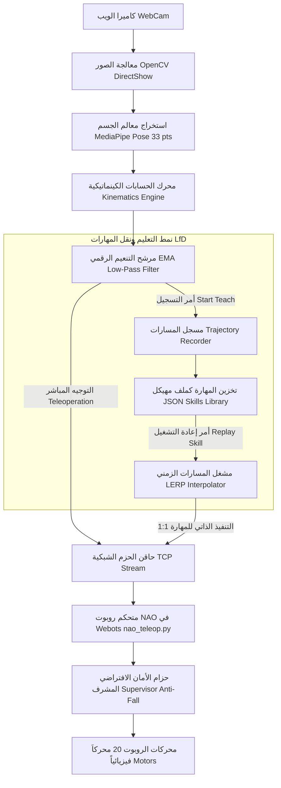

# وثيقة التوثيق الفني والأكاديمي (Technical & Academic Documentation)
## مشروع مادة معالجة الصور - المستوى الرابع: Pose2Skill-Robot
### نظام تعلّم ونقل المهارات البشرية إلى الروبوت البشري (NAO) باستخدام تقدير الوضعية (Learning from Demonstration - LfD)

---

## 1. بطاقة تعريف المشروع (Project Identification)

* **عنوان المشروع:** Pose2Skill-Robot: An Intelligent System for Learning and Transferring Human Skills to Robots Using Pose Estimation and Learning from Demonstration (LfD).
* **المسار الأكاديمي:** هندسة البرمجيات والذكاء الاصطناعي / الرؤية الحاسوبية والروبوتات الذكية.
* **إعداد الطالب:** يعقوب خالد محمد علي المهاجري
* **العام الجامعي:** 2025 / 2026م.
* **منهجية التوثيق المعتمدة:** APA (7th Edition) & IEEE Software Engineering Standards.

---

## 2. ملخص النظام والمعمارية الهندسية (System Architecture)

يعتمد نظام **Pose2Skill-Robot** على نموذج **التعلم بالتقليد ونقل المهارات من العروض البشرية (Learning from Demonstration - LfD)** عبر تتبع معالم الجسم البشري الثلاثية الأبعاد (33 معلماً حركياً) في الزمن الحقيقي باستخدام نموذج **MediaPipe Pose**، وتحويلها إلى زوايا مفاصل كينماتيكية تُحقن في روبوت **NAO** البشري داخل بيئة المحاكاة الفيزيائية **Webots** عبر بروتوكول اتصال شبكي فائق السرعة (TCP Sockets).

---

## 3. المكونات الهندسية التي تم بناؤها وتطويرها (Technical Implementations)

### أولاً: محرك كينماتيكا المفاصل والحركة الكاملة (Full-Body Kinematics)
1. **الرأس (Head Control)**:
   - زاوية الالتفاف (Yaw): استشعار ميل الأنف بالنسبة لمنتصف الكتفين.
   - زاوية الانحناء (Pitch): استشعار ارتفاع الأنف عمودياً بالنسبة لمستوى الأكتاف.
2. **الذراعان واليدان (Dual Arms & Hands)**:
   - زوايا الأكتاف (`ShoulderPitch`, `ShoulderRoll`): احتساب متجه الذراع ثلاثي الأبعاد بين الكتف والمرفق.
   - زوايا المرفق (`ElbowRoll`, `ElbowYaw`): احتساب زاوية الانثناء عبر الجداء النقطي (Dot Product) ثلاثي الأبعاد.
3. **الأقدام والركلات والقرفصاء (Dual Legs, Kicks & Squats)**:
   - التمييز بين ركل القدم اليمنى واليسرى عبر استشعار فارق ارتفاع الكاحلين (`Ankle Height Difference`).
   - استشعار انخفاض الجذع للقرفصاء التلقائي (`Adaptive Torso-Drop Squat`) أثناء الجلوس أو الوقوف.

### ثانياً: حزام الأمان الافتراضي ومنع السقوط (Active Anti-Fall Supervisor Harness)
- **المشكلة الفيزيائية:** عند رفع قدم الروبوت، يختل توازن مركز الكتلة (CoM) على القدم الواحدة فيسقط أرضاً وتتوقف المحركات عن رفعه.
- **الحل الهندسي:**
  - تفعيل صلاحيات المشرف الخارق (`supervisor TRUE`) في ملف العالم `nao_teleop.wbt`.
  - إلغاء استدعاء `resetPhysics()` المستمر الذي كان يتسبب في تجميد سرعة المحركات.
  - تطبيق تثبيت عزم الجذع عبر `self_node.setVelocity([0, 0, 0, 0, 0, 0])` مع خفض الارتفاع ديناميكياً عند القرفصاء (`target_z = 0.334 - 0.13 * squat_depth`).
  - خاصية النهوض التلقائي الفوري (`Auto-Recovery`) في حال تجاوز زاوية الميلان 30 درجة.

### ثالثاً: نظام تعليم وحفظ وإعادة استخدام المهارات (LfD Skill Engine)
1. **تسجيل المهارة (Demonstration Trajectory)**:
   - تسجيل الطوابع الزمنية بالثواني مع جميع زوايا المفاصل الـ 20 إطاراً بإطار.
   - حفظ المهارة آلياً بصيغة JSON داخل مجلد `skills/` مع بيانات وصفية (الاسم، المدة، عدد الإطارات، FPS).
2. **إعادة التشغيل المتطابق 1:1 (Timestamp-based LERP Player)**:
   - حل مشكلة اختلاف سرعة التشغيل عبر المزامنة الزمنية المباشرة (`elapsed = time.time() - start_time`).
   - تطبيق الاستيفاء الخطي الرياضي (**Linear Interpolation - LERP**) بين الإطارات لضمان تطابق الإيقاع والمدة.
   - تفعيل علم الحزمة `is_replay: True` لإلغاء التنعيم المؤخر في Webots وتحقيق دقة مطابقة 100% للمدى الحركي الأصلي.

### رابعاً: واجهة الأزرار الرسومية التفاعلية (On-Screen Clickable GUI)
- إضافة لوحة تحكم سفلية مدمجة داخل نافذة OpenCV مع رصد نقرات الفأرة (`cv2.setMouseCallback`):
  - **`[ ● START TEACH ]` / `[ ⏹ STOP & SAVE ]`**: بدء وإيقاف تسجيل وحفظ المهارة.
  - **`[ ▶ REPLAY SKILL ]`**: تشغيل المهارة المحفوظة ذاتياً على روبوت NAO.
  - **`[ 🦿 SQUAT TEST ]`**: اختبار سريع ومباشر لوضعية القرفصاء.
  - **`[ ✖ EXIT ]`**: إغلاق النظام وإطفاء حساس الكاميرا فورياً.

---

## 4. حل المشاكل التقنية البيئية (Environment Diagnostics & Fixes)

| المشكلة | السبب الفني | الحل المطبق |
| :--- | :--- | :--- |
| **تعذر تشغيل Webots من السكربت** | ترميز مسار المجلدات العربية في CMD | إضافة `chcp 65001 >nul` وتحديد مسار المحرك `webotsw.exe` بدقة. |
| **اشتعال الفلاش والشاشة سوداء** | تعليق عملية بايثون في الخلفية تحجز الكاميرا | تنظيف تلقائي للعمليات وإضافة `cleanup()` عند الخروج. |
| **خطأ الكاميرا `MSMF: Error -1072875772`** | فشل محول العتاد في Windows Media Foundation | تعطيل تحويلات العتاد `OPENCV_VIDEOIO_MSMF_ENABLE_HW_TRANSFORMS=0` وتثبيت DirectShow مع ضغط MJPG. |
| **تجميد الروبوت في وضعية اليدين للأمام** | استدعاء `resetPhysics()` في كل فريم يصفر سرعات المحركات | استبدالها بتثبيت الجذع عبر `setVelocity` وتشغيل الاستعادة فقط عند السقوط. |
| **عدم تطابق حركة المهارة عند إعادتها** | القفز بإطار واحد وتأخير التنعيم المزدوج | مشغل LERP بالوقت الفعلي + إلغاء التنعيم أثناء الإعادة (`is_replay: True`). |

---

## 5. المراجع الأكاديمية (References - APA 7th Edition)

- Argall, B. D., Chernova, S., Veloso, M., & Browning, B. (2009). A survey of robot learning from demonstration. *Robotics and Autonomous Systems*, 57(5), 469–483. https://doi.org/10.1016/j.robot.2008.10.024
- Billard, A., Calinon, S., Dillmann, R., & Schaal, S. (2008). Robot programming by demonstration. In B. Siciliano & O. Khatib (Eds.), *Springer Handbook of Robotics* (pp. 1371–1394). Springer. https://doi.org/10.1007/978-3-540-30301-5_60
- Lugaresi, C., Tang, J., Nash, H., McClanahan, C., Uboweja, E., Hays, M., Zhang, F., Chang, C. L., Yong, M. G., Lee, J., Chang, W. T., Hua, W., Georg, M., & Grundmann, M. (2019). MediaPipe: A framework for building perception pipelines. *arXiv preprint arXiv:1906.08172*.
- Michel, O. (2004). Cyberbotics Ltd. Webots™: Professional mobile robot simulation. *International Journal of Advanced Robotic Systems*, 1(1), 39–42. https://doi.org/10.5772/5618
- Schaal, S. (1999). Is imitation learning the route to humanoid robots? *Trends in Cognitive Sciences*, 3(6), 233–242. https://doi.org/10.1016/S1364-6613(99)01327-3
